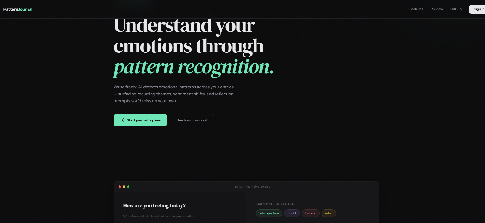
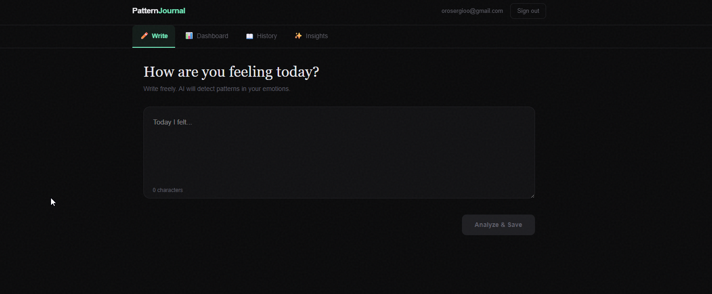
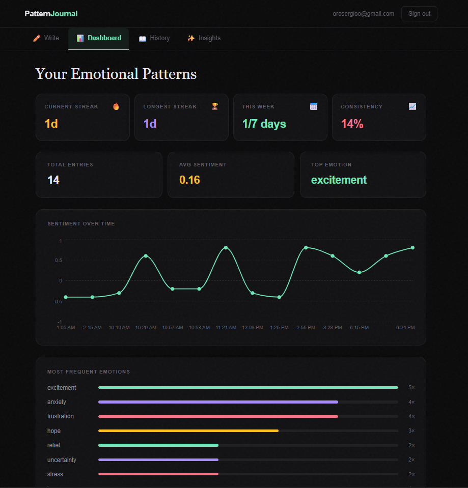
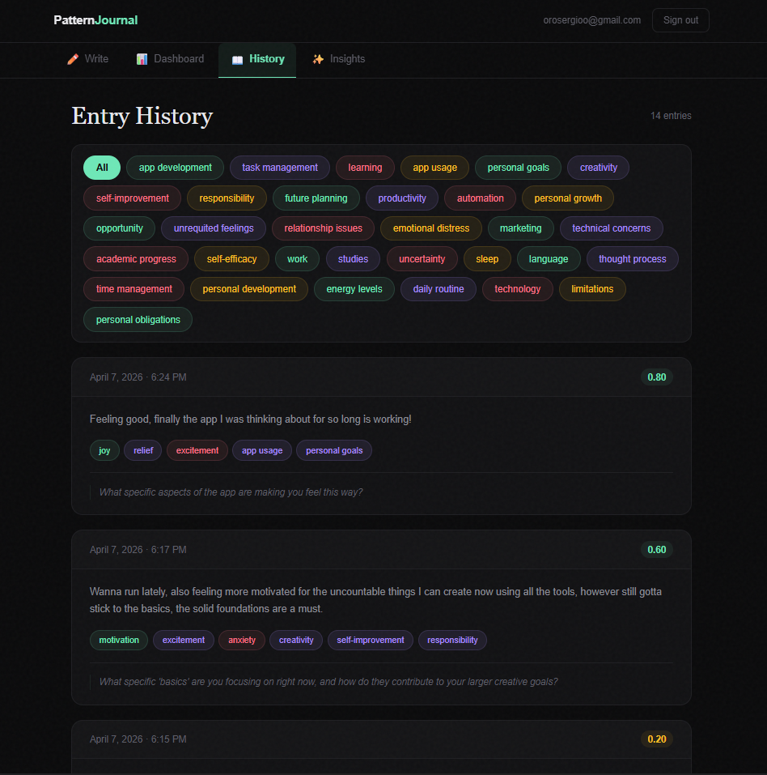
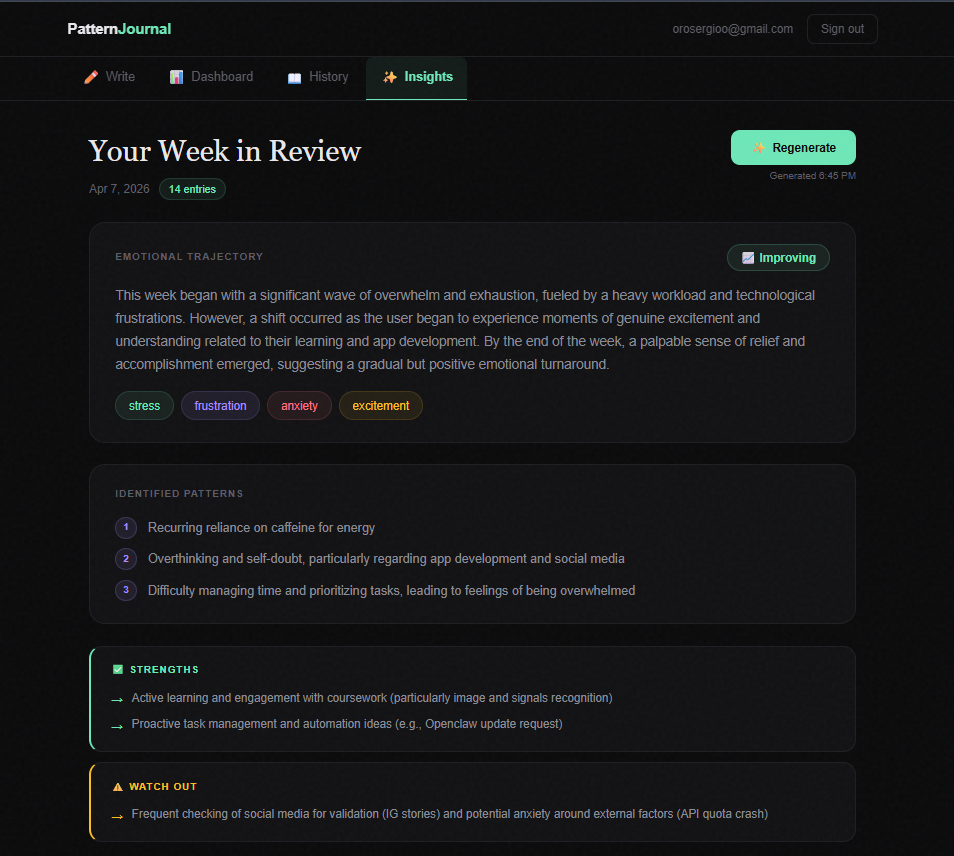
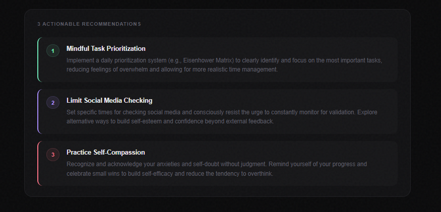

# Pattern Journal

**An AI-powered journaling app that detects emotional patterns, tracks sentiment over time, and generates weekly insight reports.**

Write freely. The AI reads between the lines.

[](https://pattern-journal.vercel.app)
[](https://ai.google.dev/)
[](https://vercel.com)

---

## What It Does

Every journal entry gets analyzed by **Google Gemma 3 4B** in real time. No templates, no prompts to fill — just write what's on your mind and the AI surfaces what you can't see yourself.

**Per entry**, the AI returns:
- 2–4 detected **emotions** (e.g. anxiety, excitement, relief)
- Recurring **themes** (e.g. relationship issues, task management, personal growth)
- A **sentiment score** from −1.0 to 1.0
- A personalized **reflection prompt** to push deeper thinking

**Across entries**, the app builds:
- A **sentiment chart** tracking your emotional trajectory over time
- **Emotion frequency bars** showing which feelings dominate your week
- **Theme tags** you can filter and explore in your history
- **Streak tracking** — current streak, longest streak, weekly consistency

**Weekly**, the AI generates:
- An **Insight Report** analyzing all entries from the past 7 days
- **Emotional trajectory** summary with direction (Improving / Declining / Stable)
- **Identified patterns** — habits and behaviors you might not notice yourself
- **Strengths** and **Watch Outs** — what you're doing well vs. what needs attention
- **3 actionable recommendations** personalized to your week

---

## Screenshots

> Replace these paths with your actual screenshot URLs after pushing to the repo.

### Landing Page


### Write + AI Analysis


### Dashboard — Sentiment & Emotion Tracking


### Entry History with Theme Filtering


### Weekly Insight Report


### Actionable Recommendations


---

## Tech Stack

| Layer | Technology |
|-------|-----------|
| Framework | **Next.js 14** (App Router) + **TypeScript** |
| Auth | **Supabase** (Google OAuth) |
| Database | **Supabase PostgreSQL** with Row Level Security |
| AI Model | **Google Gemma 3 4B** (`gemma-3-4b-it`) via Google AI Studio API |
| Charts | **Recharts** |
| Hosting | **Vercel** (auto-deploy on push) |
| Design | **DM Serif Display** + **Instrument Sans**, dark theme, emerald/violet/rose/amber accents |

---

## Architecture

```
Browser (Next.js Client)
  │
  ├── Google OAuth ──► Supabase Auth
  │
  ├── Write Entry ──► /api/analyze ──► Google AI Studio (Gemma 3 4B)
  │                        │
  │                        ▼
  │                   Returns: emotions[], themes[],
  │                   sentiment_score, reflection_prompt
  │
  ├── Save ──► Supabase PostgreSQL (RLS per user)
  │
  ├── Dashboard ──► Aggregates entries → Recharts visualizations
  │
  └── Insights ──► /api/weekly-insight ──► Gemma 3 4B (meta-analysis)
                        │
                        ▼
                   Returns: trajectory, patterns[],
                   strengths[], watch_outs[],
                   recommendations[]
```

Key decisions:
- **Gemma 3 4B over larger models** — Free tier, fast inference, good enough for emotion detection. The 4B parameter model keeps latency under 3s per analysis.
- **Server-side API routes** — API key never touches the client. All AI calls go through Next.js API routes.
- **Row Level Security** — Each user only sees their own entries. Enforced at the database level, not just the app level.
- **No external state management** — React state + Supabase real-time queries. Simple is fast.

---

## Run Locally

```bash
# Clone
git clone https://github.com/Orosergio/pattern-journal.git
cd pattern-journal

# Install
npm install

# Environment variables
cp .env.example .env.local
```

Fill in `.env.local`:

```env
NEXT_PUBLIC_SUPABASE_URL=your_supabase_url
NEXT_PUBLIC_SUPABASE_ANON_KEY=your_supabase_anon_key
GEMINI_API_KEY=your_google_ai_studio_key
```

```bash
# Run
npm run dev
```

Open [localhost:3000](http://localhost:3000).

### Getting API Keys

1. **Supabase**: Create a project at [supabase.com](https://supabase.com), enable Google OAuth, copy URL + anon key
2. **Google AI Studio**: Get a free API key at [aistudio.google.com](https://aistudio.google.com) — Gemma 3 4B is free tier

---

## Project Structure

```
src/app/
├── api/
│   ├── analyze/route.ts        # Per-entry AI emotion analysis
│   └── weekly-insight/route.ts # Weekly meta-analysis report
├── components/
│   ├── LandingPage.tsx         # Marketing page (responsive)
│   ├── JournalEntry.tsx        # Write tab + real-time AI analysis
│   ├── Dashboard.tsx           # Sentiment charts, emotion bars, streaks
│   ├── EntryHistory.tsx        # Filterable entry history with theme tags
│   └── WeeklyInsight.tsx       # Weekly insight report UI
├── lib/
│   └── supabase.ts             # Supabase client config
├── globals.css
├── layout.tsx
└── page.tsx                    # Auth gate + tab routing
```

---

## What I Learned

This was a solo build from zero to production. Some things that clicked:

- **Prompt engineering for structured output** — Getting Gemma 3 4B to consistently return valid JSON with emotions, themes, and sentiment took careful prompt design. Smaller models need tighter constraints.
- **Supabase RLS is underrated** — Writing security policies in SQL that enforce per-user data isolation at the database level means the app code can stay simple without compromising security.
- **AI meta-analysis is the real product** — Individual entry analysis is cool, but the Weekly Insight that cross-references all entries to find patterns is what makes this genuinely useful. That's where the value is.
- **Design matters for portfolio projects** — Recruiters spend 10 seconds on your repo. A polished UI with a real design system (not default Tailwind) makes them stop scrolling.

---

## Roadmap

- [ ] Mobile-responsive inner app (Dashboard, History, Insights)
- [ ] Monthly insight reports
- [ ] Export entries as PDF
- [ ] Mood calendar view
- [ ] PostHog analytics integration

---

## Author

**Sergio Orozco**
NTUT (National Taipei University of Technology) · Taipei, Taiwan

[](https://github.com/Orosergio)
[](https://orosergio.github.io/Portfolio/)

---

*Built with real journal entries, real emotions, and a 4B parameter model that punches above its weight.*
